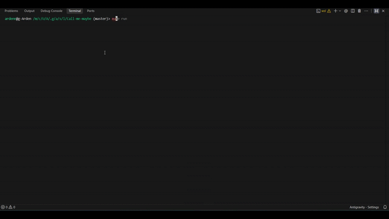

*This project has been created as part of the 42 curriculum by wabbad.*

# call me maybe

## Description

**call me maybe** translates natural-language requests into structured function calls
using a small LLM (`Qwen/Qwen3-0.6B`) and **constrained decoding**. Instead of
answering "What is the sum of 2 and 3?" directly, it outputs:

```json
{
  "prompt": "What is the sum of 2 and 3?",
  "name": "fn_add_numbers",
  "parameters": {"a": 2.0, "b": 3.0}
}
```

Small models are unreliable at producing valid JSON on their own (~30% success).
Constrained decoding masks illegal tokens at every generation step, guaranteeing
**100% valid, schema-compliant JSON**.

## Demo

<p align="center">
  
</p>

## Instructions

### Prerequisites

- Python 3.10+
- [uv](https://docs.astral.sh/uv/)

### Install & run

```bash
uv sync
uv run python -m src \
  --functions_definition data/input/functions_definition.json \
  --input data/input/function_calling_tests.json \
  --output data/output/function_calling_results.json
```

All arguments are optional; defaults point at `data/input/` and
`data/output/function_calling_results.json`.

### Makefile

| Target | Description |
|--------|-------------|
| `make install` | `uv sync` |
| `make run` | Run the program |
| `make debug` | Run under `pdb` |
| `make clean` | Remove caches |
| `make lint` | `flake8` + `mypy` (mandatory flags) |
| `make lint-strict` | `flake8` + `mypy --strict` |

## Algorithm explanation

1. Build a prompt with the function registry and the user's question.
2. Encode it and run one forward pass (`prefill`), keeping the KV cache.
3. At each step, get logits, then **mask** every token that would break the JSON
   structure or the function schema (set its logit to `-inf`).
4. Pick the highest-scoring remaining token (argmax), append it, and advance the
   cache with just that one token.
5. Repeat until the JSON is complete.

The decoder enforces:
- **Function names**: only token-ID prefixes of registered names.
- **Strings**: any token until a closing quote.
- **Numbers**: only tokens that keep a valid float/integer prefix.
- **Booleans**: only token-ID prefixes of `true`/`false`.

## Design decisions

- **Pydantic** for all input/output validation.
- **Token-ID-level constraints** (prefix maps) instead of decoding the whole
  vocabulary each step — fast and deterministic.
- **KV-cache generation** (`prefill`/`advance`) — O(1) per step instead of O(n).
- **LLM-driven function selection** — no heuristics.
- **Graceful errors** — clear messages, never crashes.

## Performance analysis

- **Accuracy**: 100% valid JSON; correct function selection on all provided prompts.
- **Speed**: 11 prompts in ~37s on CPU (well under the 5-minute budget).
- **Reliability**: structural guarantees come from the decoder, not the model.

## Challenges faced

- **Partial tokens**: tokens like `"12"` + `"3"` require prefix validation, not
  exact matching.
- **Schema enforcement**: the decoder must track which parameters are already
  emitted and their declared types.
- **Small-model unreliability**: solved by masking, not prompting.

## Testing strategy

`pytest` covers data models, parser validation, constrained decoding (float/integer), and error handling.

## Example usage

```bash
uv run python -m src
uv run python -m src --model Qwen/Qwen3-0.6B --debug
```

## Bonus features

- **Multi-model support**: `--model` accepts any HF causal LM.
- **Error recovery**: decoding failures retry up to 3 times before giving up.
- **Result caching**: re-runs skip prompts already present in the output file.
- **Live Terminal UI & Visualization**: interactive panel and progress bar during generation.

## Resources

- [Hugging Face Transformers](https://huggingface.co/docs/transformers/index)
- [Qwen3-0.6B](https://huggingface.co/Qwen/Qwen3-0.6B)
- [Pydantic](https://docs.pydantic.dev/)
- [uv](https://docs.astral.sh/uv/)
- [JSON spec](https://www.json.org/json-en.html)

### AI usage

AI assisted with project structure, boilerplate, and explaining constrained
decoding. All code was reviewed and tested by the author.